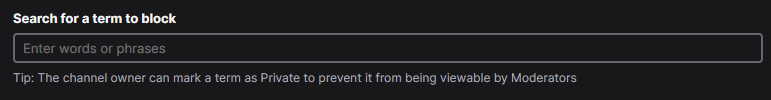
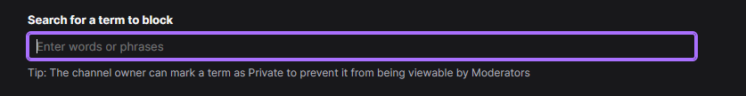

# Twitch AutoMod Banned Term Populator Tool
_An AutoHotKey script that does the typing for you._
## Purpose
Twitch offers an AutoMod tool that blocks terms and phrases you list. 
But it can take a long time to manually type them all into AutoMod.

This tool does the typing and submission for you.
This solution is great for mods helping several channels who want consistent blocked terms.

## Requirements
You must have AutoHotKey V2 installed on your PC. Visit https://www.autohotkey.com/ to download it.

This solution has been tested and developed for Windows (W11). I make no guarantees about performance or usability on Mac or Linux because I don't have ready access to either of those environments.

You need access to a web browser that can access AutoMod's Blocked terms and phrases page. I use Firefox, but tests show that chrome works too.

## Instructions
### Prepare a list of blocked terms
- Make a txt file (use UTF-8 encoding) in a place you will remember.
- Populate the text file with terms you want blocked.
    - You MUST have one term/phrase per line.
    - Do not combine multiple terms/phrases onto one line, they will be added in their combined form as a single entry.
- Save your text file

The example.txt in the directory is available if you want to check that the script is working before you invest in preparing this blocked term list.

You can run it on the example by editing the `automod_initializer.ahk` file in notepad, then removing every `;` for Option 0. 
- Be sure to add `;` to the start of the * _every_ line for options 1 and 2 if they are not already there. Otherwise, it will not know what file it should be using and it'll look confusing on your end.

Make sure you delete the test terms from automod after, or else you will do a crime against raccoons everywhere 🦝
### Ready your browser
1. Navigate to your desired AutoMod blocked terms list. You're trying to get to dashboard.twitch.tv/u/<username>/settings/moderation/automod for the channel you want to populate terms for.
    1. From twitch.tv, click the profile at the top right. Click video producer.
    2. At the left sidebar, click Settings > Moderation
    3. From Automod Controls, click "Blocked terms and phrases"
2. Decide how you want the script to find where your blocked terms text file is.
    - By default, every time you run the shortcut, it will pop up an input box.
        - You can get your file path on Windows by shift-right clicking your text file, then "Copy as Path
        - Be sure to remove the quotes at the start and end of your path if you do this.
    - If you find the input box annoying, edit the `automod_initializer.ahk` file in notepad
        - Add `;` to _every_ line under Option 2 to turn off the input box.
        - Remove `;` from _every_ line under Option 1 to turn on hard-coded text file paths.
        - Add the path to your text file as the value for `bannedTermsFile`. You should be replacing the part that says `"C:\full\path\to\file.txt"`.
            - Make sure you keep quotes around your file path! Single/double quotes are fine, but don't wrap them in more than one pair in either case.
    - If you make any changes to `automod_initializer.ahk`, make sure to save the file and reload the script!
3. Click into the term input field for Automod. It should show a purple outline and a flashing text cursor to show that it is in focus. If it is grey outlined, then it is not in focus.

    The below shows the input in grey. This won't work, we must click into it.

    

    The below shows the input in purple and with a flashing text cursor. That means it is in focus and the script can work!

4. (READ THIS STEP IN FULL BEFORE PRESSING THE SHORTCUT) Hit `Win + Z` to start the script
    - This script will read your blocked terms list line by line and enter it into automod manually.
    - You need to be careful because you cannot do anything else while it is doing this!
        - The script enters the terms as though you are typing them in, and will type them into whatever is in focus.
        - If you take your browser's focus away from the automod blocked term input, then _the script will put the blocked terms into whatever you put into focus_! That can include DMs, texts, or anything else you put your cursor into focus on while the script is running.
        - Either let the script finish before resuming using your computer, or stop it early before doing anything else (read below).
5. If you need to stop the script early, hit `Win + Z` again.
    - If that doesn't work, then either:
        - Kill the script in task manager, or
        - Kill it in your tray bar by right-clicking the green H, then hit "exit"
6. Let the script finish its work, then resume using your computer again.
7. After the script is done, you can right-click the green H in your tray bar and "exit" it.
8. Repeat the above if you make changes/additions to your blocked term list. Twitch will not do anything with redundant phrases/terms, so you don't need to worry about duplicates.
    - Duplicates will make the script take longer to finish. To get around this, consider putting your newest additions/changes to the top of your block list.
